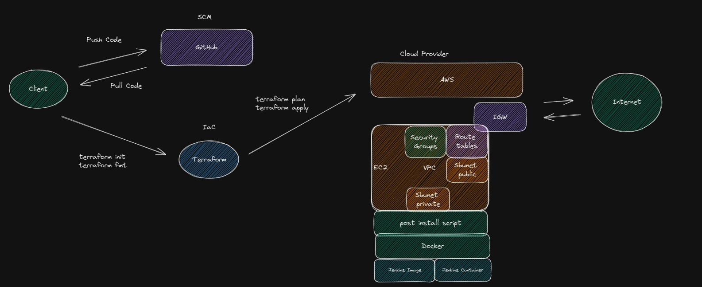

# Infrastructure as Code.
This repository contains a tool for automate IaC that is going to run the process of scanning for vulnerabilities in a list of domains.

### Requirements.
* Terraform

### Installation Locally.
Clone the repository:
```
git clone https://github.com/capstone-project-cybersecurity/infra.git
cd $PWD/infra/terraform
```

### Usage.
To run terraform, simply create an access_key and secret_key with the required permission to deploy EC2 computes in your AWS IAM service and replace it in provider.tf configuration file inside infra/terraform directory and run these commands. When the EC2 is created with Terraform, automatically is going to up a data file with a bash script that is going to install all packages that we'll need.
```
terraform init # This is going to get the terraform modules and their dependencies
terraform plan # This is going to get a plan between HCL code v.s AWS resources
terraform apply # This is going to apply the changes to AWS Cloud. The state that you are doing with terraform into AWS Cloud, is going to store it inside terraform.tfstate, json file with all changes.
```

### Flow diagram.



### More information.

[What is Terraform?](https://www.freecodecamp.org/news/how-to-use-terraform-to-automate-your-aws-cloud-infrastructure-tutorial/)

### Contributing.
We welcome contributions to this project. If you would like to contribute, please fork the repository and create a pull request with your changes.

### License.
This project is licensed under the [MIT License](https://opensource.org/licenses/MIT).